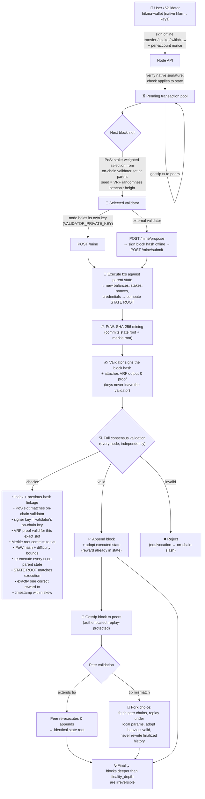

# Hikmalayer Core

## What is Hikmalayer core?
Hikmalayer Core is a sovereign hybrid Layer‑1 blockchain that combines Proof‑of‑Stake
(validator selection) with Proof‑of‑Work (block finalization). It has its own native
cryptographic identity — no dependency on Ethereum or any other chain's address or
signing conventions. It provides:

- **A replicated on-chain state machine.** Balances, the validator set, per-account
  nonces, and slashing are a deterministic function of the block history. Every block
  commits to the resulting state via a **state root**, so every node independently
  verifies that every other node executed the chain correctly.
- **Native identity.** Addresses are `hkm…` (SHA-256 over the secp256k1 public key) and
  messages are signed under a native Hikmalayer signing domain. Keys are a cryptographic
  primitive (secp256k1), not an external-chain dependency.
- **On-chain validator set.** Staking and withdrawals are signed on-chain transactions;
  the validator set is derived from state, not node-local bookkeeping.
- **VRF randomness beacon (unbiasable leader election).** Every block carries an
  sr25519 VRF proof; outputs fold into an on-chain beacon that seeds stake-weighted
  leader selection. A VRF output is unique per (key, slot) — there is nothing for a
  validator to grind.
- **⭐ Proof-of-Credential — on-chain verifiable credentials.** Issue, verify, and
  revoke credentials as first-class consensus objects. Only a hash of the credential
  document goes on-chain (privacy by design); any third party verifies a credential
  against the block-committed state root without trusting a node. Built for the
  chain's mission: digital identity anchoring and credential verification.
- PoS validator selection (stake-weighted, seeded by the VRF beacon) verified
  against the on-chain validator set at each block's parent state.
- PoW mining and PoW validation for every block, with bounded difficulty.
- Deterministic genesis, Merkle-root transaction commitment, and full-chain replay.
- Signed transactions with per-account nonces (replay protection).
- Fork choice by cumulative work with finalized-history protection; adopted chains are
  re-executed under local network parameters and their state rebuilt from genesis.
- P2P block and transaction gossip, peer chain sync, and P2P message replay protection.
- **Cryptographic node identity.** Every gossip envelope is signed by the sender's node
  key and bound to its derived `node_id`; set `P2P_REQUIRE_IDENTITY=true` to reject any
  unsigned envelope — a per-node keypair handshake layered on the bearer token.
- **Peer reputation & banning.** Useful blocks/transactions raise a peer's score, invalid
  or malformed messages lower it, and repeat offenders are auto-banned; an optional
  `P2P_ALLOWLIST` restricts participation to named validator node ids.
- **Snapshots & checkpoints.** `GET /snapshot` exports the tip state with its
  authenticating commitments; `GET /checkpoint` returns a pinnable finalized
  (height, block_hash, state_root) triple for weak-subjectivity anchoring.
- **Permissionless slashing with an unbonding guarantee:** anyone holding a proof that a
  validator signed two blocks at the same height can submit it; the offender's stake is
  burned on-chain. Withdrawn stake unbonds over 20 blocks and stays slashable for the
  entire slashing window — misbehaving stake can never exit before punishment.
- **Dynamic fee market + DoS bounds.** A congestion-responsive **base fee**
  (EIP-1559-style, ±12.5%/block toward a target block fullness) is charged per
  value-bearing transaction and paid to the block validator. The base fee lives
  in the state root, so every node recomputes the identical fee — a consensus-
  enforced fee market on a hybrid PoW+PoS+VRF chain. Plus mempool, per-block,
  and request-body caps. Query the live fee at `GET /fees`.
- **Self-adjusting difficulty.** PoW difficulty retargets deterministically every 10
  blocks toward a 15-second block time — consensus-validated, not operator-set — and
  mining runs off the async executor so the node stays responsive.
- Block rewards minted to the producing validator on block acceptance.
- An offline wallet/validator signing CLI (`hikma-wallet`) — private keys never touch
  the node or the network.
- Persistence to disk (chain only; balances/stakes/nonces are replayed on startup).
- A React dashboard for local interaction and testing workflows.

Hikmalayer is developed by Muhammad Ayan Rao, Founder and Director of Bestower Labs Limited.

This repository represents a production-focused hybrid L1 foundation implementing core consensus 
mechanics and operational services for future industrial-grade deployments.

For the official whitepaper, see `docs/Whitepaper.md`.

### Phase-4 Local Benchmark Results (API Execution Layer)
A Phase-4 local benchmark was conducted using a multi-container Docker Compose deployment (bootnode + validators + RPC + Prometheus + Grafana) to validate transaction execution throughput and operational stability.

**Environment:**

- Windows host
- Docker Compose multi-service deployment
- REST API transaction harness
- Prometheus + Grafana monitoring enabled

**10-Minute Sustained Run:**

- Duration: 600 seconds
- Total Transactions: 8,940
- Average Throughput: 14.88 TPS
- Average Latency: ~67 ms
- Reorg Count: 0 (instrumentation pending)
- Average Memory Per Node: ~4–5 MB

**Observations:**

- Continuous transaction load sustained without crashes.
- All services remained stable throughout the run.
- Extremely low memory footprint across all nodes.
- No chain reorganizations observed.
- Block production and finalized height are not yet included in this benchmark, as Phase-4 currently focuses on REST/API execution throughput rather than full P2P consensus orchestration.

**Scope Clarification:**

This benchmark measures transaction execution performance at the REST/API layer using a local multi-container deployment.

Full peer-to-peer consensus benchmarking (validator gossip, block finalization, fork handling, and genesis bootstrapping) is scheduled for Phase-5 (public testnet).

**Phase-4 Status:**

- Multi-node containerized environment operational
- Monitoring stack active (Prometheus + Grafana)
- Benchmark harness validated
- Sustained load test completed successfully

## Phase-4 Engineering Milestone: COMPLETE

- Benchmark artifacts are available under:

```bash
bench/results/run_10min/
```


## Licence
Hikmalayer licensing is split between source code, contributions, and documentation:

- **HikmaLayer Business Source License 1.1** for the protocol source code (see [`LICENSE`](LICENSE)).
- **HikmaLayer Contributor License Agreement (CLA)** for incoming contributions (see [`CLA.md`](CLA.md)).
- **Whitepaper** is released under **Creative Commons Attribution 4.0 International (CC BY 4.0)** to
  allow broad redistribution with attribution.

## Development process
Hikmalayer Core is developed in phases:

- **Phase 1**: Core PoW and chain primitives.
- **Phase 2**: PoS validator selection, staking, and validator identities.
- **Phase 3**: Persistence, P2P gossip, governance, slashing, and async‑safe services.
- **Phase 4**: Operational hardening, Dockerized multi-node deployment, monitoring, and benchmark validation. (Completed for API execution layer.)
- **Phase 5**: P2P validator consensus, gossip, fork choice, finality.
- **Phase 6**: Replicated on-chain state machine, native identity, on-chain validator set.
- **Phase 7**: VRF unbiasable leader election + Proof-of-Credential registry.
- **Phase 8**: Unbonding + slashing window, tx fees, difficulty retargeting, DoS bounds.
- **Phase 9**: Signed P2P identity, peer scoring/banning, snapshots/checkpoints, observability.
- **Mainnet (pending)**: External audit + adversarial testnet, economic modeling, ops hardening.


## 🔄 How it works — consensus workflow

The full life of a transaction and block, from wallet to finality:



Key consensus rules:

| Rule | Mechanism |
|---|---|
| Native identity | `hkm` + SHA-256(secp256k1 pubkey)[..20]; messages signed under the Hikmalayer signing domain — no external-chain conventions |
| Who may produce the next block | Stake-weighted PoS from the **on-chain** validator set, seeded by the **VRF randomness beacon** at the parent (`beacon:height`) |
| Why leader election is unbiasable | Each block's sr25519 VRF output is unique per (validator key, slot) and folds into the beacon — a producer cannot grind future assignments (residual bias: withhold-and-forfeit only) |
| Proof the right validator produced it | secp256k1 signature over the block hash, checked against the validator's **on-chain** registered key |
| State agreement | Every block commits a **state root**; nodes re-execute all transactions and reject any block whose root ≠ executed state |
| Tamper evidence | Merkle root over transactions, both roots committed into the PoW-mined hash |
| Work requirement | SHA-256 PoW at chain difficulty (bounded 1–5) |
| Transaction authenticity | Every transfer/stake/withdraw carries a native signature, re-verified at consensus level |
| Replay protection | Per-account on-chain nonces + P2P message-ID cache |
| Conflicting chains | Heaviest-cumulative-work valid chain wins; adopted chains re-execute from genesis; finalized blocks can never be rewritten |
| Misbehavior | Permissionless equivocation proofs slash the offender's stake on-chain (burned); proofs accepted within the slashing window only |
| Exit safety | Withdrawals unbond for 20 blocks (still slashable); slashing window = unbonding period, so no exit-before-slash |
| Fees | Flat per-tx fee, consensus-executed, paid to the block validator via `end_block` |
| Difficulty | Deterministic retarget every 10 blocks toward 15s block time; producer-chosen difficulty is rejected |

## 🔐 Security model

- **Sovereign native identity.** `hkm…` addresses and a native signing domain — no reliance
  on Ethereum or any other chain's address/signature format. secp256k1 is used purely as a
  cryptographic primitive.
- **No private keys on the node.** Validators keep keys offline (`hikma-wallet`) or in the
  node's local environment (`VALIDATOR_PRIVATE_KEY` — the node's *own* identity only).
  The API never accepts a private key.
- **Replicated state, verified everywhere.** No node can forge a balance or a credential:
  state is a pure function of the blocks and every node checks the committed state root
  by re-execution.
- **Unbiasable randomness.** Leader election is seeded by a VRF beacon (audited
  sr25519/schnorrkel, as used by Polkadot) — validator-unique, publicly verifiable,
  nothing to grind.
- **Rotating, constant-time authorization tokens.** Admin/P2P tokens support
  `*_TOKEN_CURRENT`/`*_TOKEN_PREVIOUS` rotation and are compared in constant time.
- **Signed everything.** Transfers, stakes, and withdrawals require native signatures;
  staking addresses are cryptographically bound to their keys
  (`address = hkm + SHA-256(pubkey)[..20]`).
- **Deny-by-default authorization.** P2P endpoints require `x-p2p-token`; admin endpoints
  (faucet, certificates, difficulty, governance) require `x-admin-token`. Unset = disabled.
- **Bounded resources.** Difficulty is clamped (1–5) so a bad difficulty can neither
  disable PoW nor stall the node; explorer inputs are length-limited.

## ⭐ Flagship: Proof-of-Credential

Hikmalayer's differentiator is a **credential layer built into consensus** — not a
smart contract bolted on top. Universities, licensing bodies, and employers issue
credentials as signed on-chain transactions; anyone verifies them against the
chain's state root in one call.

```bash
# 1. Issuer signs the credential action offline (only the DOCUMENT HASH goes on-chain)
hikma-wallet sign-credential degree-2026-001 hkm<student> $(sha256sum diploma.pdf | cut -d' ' -f1) false <nonce> <issuer_key>

# 2. Submit — it becomes a consensus object when mined
curl -X POST localhost:3000/credentials/issue -d '{
  "id": "degree-2026-001", "subject": "hkm<student>",
  "data_hash": "<sha256 of the document>", "issuer": "hkm<issuer>",
  "nonce": 1, "public_key": "<issuer pub>", "signature": "<sig>"
}'

# 3. Anyone, anywhere verifies — and gets a portable, state-root-bound proof
curl localhost:3000/credentials/degree-2026-001/proof
#   → { credential, height, state_root, block_hash }

# 4. Revocation is a first-class on-chain operation (issuer-only, instant)
curl -X POST localhost:3000/credentials/revoke -d '{ "id": "degree-2026-001", … }'
```

Why it stands out:

| | Typical chains | Hikmalayer |
|---|---|---|
| Credential logic | Smart-contract per issuer | Native consensus objects |
| Verification | Requires contract ABI + indexer | One HTTP call, checked against the state root |
| Privacy | Data often on-chain | Only the document hash on-chain |
| Revocation | Contract-specific | Protocol-level, issuer-signed, instant |
| Trust needed | The RPC node | None — the proof binds to the replicated state root |

## Running a node

```bash
# generate a native identity (offline; keys never leave your machine)
cargo run --bin hikma-wallet keygen
#   → private_key / public_key / address (hkm…)

# run a validator node (genesis params identical across a network)
ADMIN_TOKEN=... P2P_TOKEN=... VALIDATOR_PRIVATE_KEY=<hex> PORT=3000 cargo run

# fund an account from the treasury faucet (dev; node needs TREASURY_PRIVATE_KEY)
curl -X POST localhost:3000/tokens/faucet -H "x-admin-token: ..." \
     -d '{"to":"<hkm-address>","amount":500}'
curl -X POST localhost:3000/mine    # execute the faucet transfer on-chain

# stake to become a validator (signed offline, executes on-chain)
nonce=$(curl -s localhost:3000/tokens/nonce/<hkm-address> | jq .next_nonce)
sig=$(hikma-wallet sign-stake <hkm-address> 100 $nonce <private_key> | awk '/signature/{print $2}')
curl -X POST localhost:3000/staking/deposit \
     -d '{"address":"<hkm-address>","amount":100,"public_key":"<pub>","nonce":'$nonce',"signature":"'$sig'"}'
curl -X POST localhost:3000/mine

# inspect the replicated state
curl localhost:3000/blockchain/state    # height, state_root, supply, validators
```

Genesis parameters (`GENESIS_TREASURY_ADDRESS`, `GENESIS_VALIDATOR_PUBLIC_KEY`,
`GENESIS_SUPPLY`) are part of chain identity — every node on a network must share them
or their genesis hashes differ and they will not sync. Unset = the well-known **dev**
genesis (fine for local use only).

A full multi-node local testnet (bootnode + 4 validators + RPC + monitoring):

```bash
./ops/start_testnet.sh
```

## Testing
Run the Rust test suite:

```bash
cargo test
```

## Automated testing
Automated tests run via `cargo test` (also in CI, `.github/workflows/rust.yml`) and cover:
chain replay & state-root verification, on-chain staking/withdrawal, equivocation
slashing, fork choice and finality protection, PoS selection, block/transaction
signature verification, Merkle integrity, replay protection (nonces and
P2P envelopes), authorization gating, and the full mine/propose/submit flows.

## Manual Quality Assurance testing
Manual QA can be performed using the API and dashboard:

- Start the backend (`cargo run`) and the dashboard (`npm run dev` in `dashboard/`).
- Verify mining, staking, transfers, and validation flows.
- Validate P2P peer registration and block gossip by running two nodes with different ports.

For secured environments, set `P2P_TOKEN` and `ADMIN_TOKEN` to require `x-p2p-token` and
`x-admin-token` headers for P2P and governance/slashing endpoints.

## Translations
No translations are included yet. If you want to add documentation translations, create locale‑
specific README files (for example `README.es.md`, `README.fr.md`).

## 📈 Performance Snapshot (Phase-4 Local Benchmark)

> Pre-mainnet API execution layer benchmark using Docker Compose multi-node deployment.

| Metric | Result |
|------|--------|
| Duration | 600 seconds |
| Total Transactions | 8,940 |
| Average Throughput | **14.88 TPS** |
| Average Latency | ~67 ms |
| Reorg Count | 0 (instrumentation pending) |
| Avg Memory per Node | ~4–5 MB |
| Deployment | Docker Compose (bootnode + validators + RPC) |

### Benchmark artifacts

```bash
bench/results/run_10min/
```

Includes:

- `benchmark_report.json`
- `benchmark_report.csv`
- `benchmark_report.md`

---

## 🏗 Phase-5 Roadmap (Public Testnet)

Phase-5 introduces peer-to-peer validator networking and public testnet deployment.

### Planned milestones

### Genesis & Network Bootstrap

- Deterministic genesis generation  
- Validator key provisioning  
- Initial stake distribution  

### Validator Roles

- Dedicated bootnode  
- Validator nodes  
- RPC / observer nodes  

### P2P Consensus Layer

- Validator gossip network  
- Block propagation  
- Fork handling  
- Finality depth tracking  

### Security Hardening

- Permissioned validator onboarding  
- Signed peer handshakes  
- Slashing enforcement  
- Replay protection  

### Public Testnet Deployment

- Multi-host deployment  
- External validators  
- Chain explorers  
- Public RPC endpoints  

---

## 📊 Architecture Overview

Current implementation provides:

- Replicated on-chain state machine with per-block **state-root** commitment  
- Native `hkm…` identity and signing domain (no external-chain dependency)  
- On-chain validator set: staking & withdrawal are signed on-chain transactions  
- VRF randomness beacon (sr25519) seeding unbiasable leader election  
- Proof-of-Credential: native on-chain verifiable credentials with state-root proofs  
- Hybrid PoS validator selection + PoW block finalization (enforced end-to-end)  
- Deterministic genesis + Merkle-committed transactions  
- Signed transactions with on-chain nonce replay protection  
- Fork choice by cumulative work, with re-execution and finality protection  
- Block & transaction gossip, peer chain sync, and P2P replay protection  
- Offline validator signing flow (`/mine/propose` → `hikma-wallet sign-block` → `/mine/submit`)  
- Permissionless equivocation slashing (stake burned on-chain), bounded by a slashing window  
- Unbonding withdrawals (20 blocks, slashable until released)  
- Per-tx fees to validators; mempool/block/body caps; deterministic difficulty retargeting  
- Block rewards, governance configuration  
- Persistent chain (state replayed on startup), smart contract / certificate subsystem  
- Dockerized orchestration, monitoring + metrics  

### Remaining before public mainnet

See [`docs/mainnet_readiness.md`](docs/mainnet_readiness.md) for the full checklist
(VRF-based leader election, signed peer handshakes, fee market, difficulty retargeting,
and an external security audit).

---

## 🚀 Ecosystem Note

Hikmalayer is designed as a trust-critical Layer-1 blockchain optimized for:

- Digital identity anchoring  
- Credential verification  
- Tokenized incentives  
- Validator accountability  

The architecture prioritizes:

- Deterministic validator selection  
- Cryptographic block finalization  
- Low operational overhead  
- Enterprise-grade deployability  

Phase-4 benchmarks demonstrate a stable execution foundation suitable for distributed network expansion.

---

## 🧭 Project Status

| Phase | Status |
|------|--------|
| Phase 1 | ✅ Complete |
| Phase 2 | ✅ Complete |
| Phase 3 | ✅ Complete |
| Phase 4 | ✅ Complete (Execution + Ops) |
| Phase 5 | ✅ Consensus layer complete (gossip, fork choice, finality, signed txs) |
| Phase 6 | ✅ Replicated on-chain state machine, native identity, on-chain validator set & slashing |
| Phase 7 | ✅ VRF randomness beacon (unbiasable leader election) + Proof-of-Credential registry |
| Phase 8 | ✅ Unbonding + slashing window, tx fees, difficulty retargeting, mempool/DoS bounds, async mining |
| Phase 9 | ✅ Signed P2P identity, peer scoring/banning, allow-list, snapshots/checkpoints, observability |
| Mainnet | 🚧 External audit + adversarial testnet, economic modeling, ops hardening (see `docs/mainnet_readiness.md`) |


## Project directory
```
hikmalayer-core/
├── bench/
│   ├── benchmark.py
│   └── results/
│       ├── run_10min/
│       └── test_run/
├── dashboard/
│   ├── public/
│   ├── src/
│   │   ├── assets/
│   │   ├── components/
│   │   └── hooks/
│   ├── index.html
│   ├── package.json
│   └── vite.config.js
├── docs/
│   ├── API.md
│   ├── Whitepaper.md
│   ├── audit_readiness_pack.md
│   ├── benchmark_report.md
│   ├── consensus_flow.md
│   ├── key_management.md
│   ├── repo_readme_audit.md
│   ├── repository_code_audit.md
│   ├── security_hardening.md
│   ├── threat_model.md
│   ├── validator_lifecycle.md
│   └── whitepaper_short_version.md
├── ops/
│   ├── prometheus/
│   ├── README.md
│   ├── reset_chain.sh
│   ├── run_benchmark.sh
│   ├── start_testnet.sh
│   └── stop_testnet.sh
├── src/
│   ├── api/
│   ├── auth/
│   ├── blockchain/
│   ├── consensus/
│   ├── contract/
│   ├── p2p/
│   │   ├── mod.rs
│   │   ├── protocol.rs
│   │   └── service.rs
│   ├── bin/
│   │   └── hikma-wallet.rs
│   ├── governance.rs
│   ├── lib.rs
│   ├── main.rs
│   └── persistence.rs
├── BENCHMARKING.md
├── CLA.md
├── Cargo.toml
├── Dockerfile
├── LICENSE
├── README.md
└── docker-compose.yml
```
## Security Status (Sprint 1 Remediation)

The following pre-identified security findings have been remediated:

- **HM-03 (High)** — JWT authentication middleware previously accepted any non-empty token as valid, without actually verifying it. Replaced with real signature verification using the `jsonwebtoken` crate; requests with missing, malformed, or invalid tokens are now rejected with `401 Unauthorized`.
- **HM-06 (Medium)** — Replaced the single static shared secret with support for rotating token pairs (`*_TOKEN_CURRENT` / `*_TOKEN_PREVIOUS`), allowing secrets to be rotated without invalidating all active sessions at once.

### Environment Variables

| Variable | Purpose |
|---|---|
| `P2P_TOKEN_CURRENT` | Active P2P authentication token |
| `P2P_TOKEN_PREVIOUS` | Previous P2P token, valid during rotation window |
| `ADMIN_TOKEN_CURRENT` | Active admin authentication token |
| `ADMIN_TOKEN_PREVIOUS` | Previous admin token, valid during rotation window |
| `P2P_TOKEN` / `ADMIN_TOKEN` | Legacy single-token variables (still supported) |