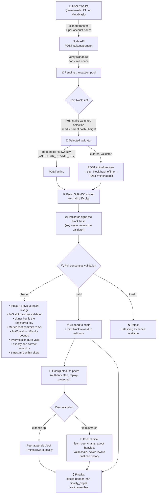

# Hikmalayer Core

## What is Hikmalayer core?
Hikmalayer Core is a hybrid Layer‑1 blockchain that combines Proof‑of‑Stake (validator
selection) with Proof‑of‑Work (block finalization). It provides:

- PoS validator selection (stake-weighted, height-salted deterministic seed) with
  validator signature verification against the registered staker set.
- PoW mining and PoW validation for every block, with bounded difficulty.
- Deterministic genesis, Merkle-root transaction commitment, and full-chain validation.
- Signed transactions with per-account nonces (replay protection); two signature
  schemes are supported — raw secp256k1 (hikma-wallet CLI) and Ethereum
  `personal_sign` (MetaMask).
- Fork choice by cumulative work with finalized-history protection, plus P2P gossip,
  peer chain sync, and P2P message replay protection.
- Governance and slashing configuration for validator accountability.
- Block rewards minted to the producing validator on block acceptance.
- An offline wallet/validator signing CLI (`hikma-wallet`) — validator private keys
  never touch the node or the network.
- Persistence of chain state to disk for safe restarts.
- A React dashboard for local interaction and testing workflows.

Hikmalayer is developed by Muhammad Ayan Rao, Founder and Director of Bestower Labs Limited.

This repository represents a production-focused hybrid L1 foundation implementing core consensus 
mechanics and operational services for future industrial-grade deployments.

For the official whitepaper, see `docs/Whitepaper.md`.

### Phase-4 Local Benchmark Results (API Execution Layer)
A Phase-4 local benchmark was conducted using a multi-container Docker Compose deployment (bootnode + validators + RPC + Prometheus + Grafana) to validate transaction execution throughput and operational stability.

**Environment:**

- Windows host
- Docker Compose multi-service deployment
- REST API transaction harness
- Prometheus + Grafana monitoring enabled

**10-Minute Sustained Run:**

- Duration: 600 seconds
- Total Transactions: 8,940
- Average Throughput: 14.88 TPS
- Average Latency: ~67 ms
- Reorg Count: 0 (instrumentation pending)
- Average Memory Per Node: ~4–5 MB

**Observations:**

- Continuous transaction load sustained without crashes.
- All services remained stable throughout the run.
- Extremely low memory footprint across all nodes.
- No chain reorganizations observed.
- Block production and finalized height are not yet included in this benchmark, as Phase-4 currently focuses on REST/API execution throughput rather than full P2P consensus orchestration.

**Scope Clarification:**

This benchmark measures transaction execution performance at the REST/API layer using a local multi-container deployment.

Full peer-to-peer consensus benchmarking (validator gossip, block finalization, fork handling, and genesis bootstrapping) is scheduled for Phase-5 (public testnet).

**Phase-4 Status:**

- Multi-node containerized environment operational
- Monitoring stack active (Prometheus + Grafana)
- Benchmark harness validated
- Sustained load test completed successfully

## Phase-4 Engineering Milestone: COMPLETE

- Benchmark artifacts are available under:

```bash
bench/results/run_10min/
```


## Licence
Hikmalayer licensing is split between source code, contributions, and documentation:

- **HikmaLayer Business Source License 1.1** for the protocol source code (see [`LICENSE`](LICENSE)).
- **HikmaLayer Contributor License Agreement (CLA)** for incoming contributions (see [`CLA.md`](CLA.md)).
- **Whitepaper** is released under **Creative Commons Attribution 4.0 International (CC BY 4.0)** to
  allow broad redistribution with attribution.

## Development process
Hikmalayer Core is developed in phases:

- **Phase 1**: Core PoW and chain primitives.
- **Phase 2**: PoS validator selection, staking, and validator identities.
- **Phase 3**: Persistence, P2P gossip, governance, slashing, and async‑safe services.
- **Phase 4**: Operational hardening, Dockerized multi-node deployment, monitoring, and benchmark validation. (Completed for API execution layer.)
- **Phase 5 (in progress)**: Public testnet with full P2P validator consensus and finalized-state tracking.


## 🔄 How it works — consensus workflow

The full life of a transaction and block, from wallet to finality:



Key consensus rules:

| Rule | Mechanism |
|---|---|
| Who may produce the next block | Stake-weighted PoS selection, seeded by `parent_hash:height` |
| Proof the right validator produced it | secp256k1 signature over the block hash, checked against the validator's **registered** staker key |
| Tamper evidence | Merkle root over transactions, committed into the PoW-mined hash |
| Work requirement | SHA-256 PoW at chain difficulty (bounded 1–5) |
| Transaction authenticity | Every transfer carries the sender's signature, re-verified at consensus level |
| Replay protection | Per-account strictly increasing nonces (API) + message-ID cache (P2P) |
| Conflicting chains | Heaviest-cumulative-work valid chain wins; finalized blocks can never be rewritten |
| Misbehavior | Slashing evidence endpoints; provably invalid blocks slash the validator's stake |

## 🔐 Security model

- **No private keys on the node.** Validators keep keys offline (`hikma-wallet`) or in the
  node's local environment (`VALIDATOR_PRIVATE_KEY` — the node's *own* identity only).
  The API never accepts a private key.
- **Signed everything.** Transfers, stakes, and withdrawals require signatures; staking
  addresses are cryptographically bound to their keys (`address = keccak(pubkey)[12..]`).
- **Deny-by-default authorization.** P2P endpoints require `x-p2p-token`; admin endpoints
  (faucet, certificates, difficulty, governance, slashing) require `x-admin-token`.
  Unset token = endpoint disabled.
- **Bounded resources.** Difficulty is clamped (1–5) so a bad difficulty can neither
  disable PoW nor stall the node; explorer inputs are length-limited.

## Running a node

```bash
# generate a validator identity (offline)
cargo run --bin hikma-wallet keygen

# run a validator node
ADMIN_TOKEN=... P2P_TOKEN=... VALIDATOR_PRIVATE_KEY=<hex> PORT=3000 cargo run

# fund + stake (signature produced offline)
hikma-wallet sign-stake <address> 100 1 <private_key>
curl -X POST localhost:3000/tokens/faucet -H "x-admin-token: ..." -d '{"to":"<address>","amount":200}'
curl -X POST localhost:3000/staking/deposit -d '{"address":"<address>","amount":100,"public_key":"<pub>","nonce":1,"signature":"<sig>"}'

# produce blocks
curl -X POST localhost:3000/mine
```

A full multi-node local testnet (bootnode + 4 validators + RPC + monitoring):

```bash
./ops/start_testnet.sh
```

## Testing
Run the Rust test suite:

```bash
cargo test
```

## Automated testing
Automated tests run via `cargo test` (also in CI, `.github/workflows/rust.yml`) and cover:
chain validation, fork choice and finality protection, PoS selection, block/transaction
signature verification (both schemes), Merkle integrity, replay protection (nonces and
P2P envelopes), authorization gating, and the full mine/propose/submit flows.

## Manual Quality Assurance testing
Manual QA can be performed using the API and dashboard:

- Start the backend (`cargo run`) and the dashboard (`npm run dev` in `dashboard/`).
- Verify mining, staking, transfers, and validation flows.
- Validate P2P peer registration and block gossip by running two nodes with different ports.

For secured environments, set `P2P_TOKEN` and `ADMIN_TOKEN` to require `x-p2p-token` and
`x-admin-token` headers for P2P and governance/slashing endpoints.

## Translations
No translations are included yet. If you want to add documentation translations, create locale‑
specific README files (for example `README.es.md`, `README.fr.md`).

## 📈 Performance Snapshot (Phase-4 Local Benchmark)

> Pre-mainnet API execution layer benchmark using Docker Compose multi-node deployment.

| Metric | Result |
|------|--------|
| Duration | 600 seconds |
| Total Transactions | 8,940 |
| Average Throughput | **14.88 TPS** |
| Average Latency | ~67 ms |
| Reorg Count | 0 (instrumentation pending) |
| Avg Memory per Node | ~4–5 MB |
| Deployment | Docker Compose (bootnode + validators + RPC) |

### Benchmark artifacts

```bash
bench/results/run_10min/
```

Includes:

- `benchmark_report.json`
- `benchmark_report.csv`
- `benchmark_report.md`

---

## 🏗 Phase-5 Roadmap (Public Testnet)

Phase-5 introduces peer-to-peer validator networking and public testnet deployment.

### Planned milestones

### Genesis & Network Bootstrap

- Deterministic genesis generation  
- Validator key provisioning  
- Initial stake distribution  

### Validator Roles

- Dedicated bootnode  
- Validator nodes  
- RPC / observer nodes  

### P2P Consensus Layer

- Validator gossip network  
- Block propagation  
- Fork handling  
- Finality depth tracking  

### Security Hardening

- Permissioned validator onboarding  
- Signed peer handshakes  
- Slashing enforcement  
- Replay protection  

### Public Testnet Deployment

- Multi-host deployment  
- External validators  
- Chain explorers  
- Public RPC endpoints  

---

## 📊 Architecture Overview

Current implementation provides:

- Hybrid PoS validator selection + PoW block finalization (enforced end-to-end)  
- Deterministic genesis + Merkle-committed transactions  
- Signed transactions with nonce replay protection (secp256k1 + MetaMask personal_sign)  
- Fork choice by cumulative work with finality protection  
- Block gossip, peer chain sync, and P2P replay protection  
- Offline validator signing flow (`/mine/propose` → `hikma-wallet sign-block` → `/mine/submit`)  
- Block rewards, governance + slashing primitives  
- REST execution layer (benchmarked)  
- Persistent chain state, token subsystem, smart contract execution framework  
- Dockerized orchestration, monitoring + metrics  

### Remaining before public mainnet

See [`docs/mainnet_readiness.md`](docs/mainnet_readiness.md) for the full checklist
(on-chain validator-set state machine, VRF-based leader election, external security
audit, and more).

---

## 🚀 Ecosystem Note

Hikmalayer is designed as a trust-critical Layer-1 blockchain optimized for:

- Digital identity anchoring  
- Credential verification  
- Tokenized incentives  
- Validator accountability  

The architecture prioritizes:

- Deterministic validator selection  
- Cryptographic block finalization  
- Low operational overhead  
- Enterprise-grade deployability  

Phase-4 benchmarks demonstrate a stable execution foundation suitable for distributed network expansion.

---

## 🧭 Project Status

| Phase | Status |
|------|--------|
| Phase 1 | ✅ Complete |
| Phase 2 | ✅ Complete |
| Phase 3 | ✅ Complete |
| Phase 4 | ✅ Complete (Execution + Ops) |
| Phase 5 | ✅ Consensus layer complete (gossip, fork choice, finality, signed txs); public deployment pending |
| Phase 6 | 🚧 Mainnet hardening (see `docs/mainnet_readiness.md`) |


## Project directory
```
hikmalayer-core/
├── bench/
│   ├── benchmark.py
│   └── results/
│       ├── run_10min/
│       └── test_run/
├── dashboard/
│   ├── public/
│   ├── src/
│   │   ├── assets/
│   │   ├── components/
│   │   └── hooks/
│   ├── index.html
│   ├── package.json
│   └── vite.config.js
├── docs/
│   ├── API.md
│   ├── Whitepaper.md
│   ├── audit_readiness_pack.md
│   ├── benchmark_report.md
│   ├── consensus_flow.md
│   ├── key_management.md
│   ├── repo_readme_audit.md
│   ├── repository_code_audit.md
│   ├── security_hardening.md
│   ├── threat_model.md
│   ├── validator_lifecycle.md
│   └── whitepaper_short_version.md
├── ops/
│   ├── prometheus/
│   ├── README.md
│   ├── reset_chain.sh
│   ├── run_benchmark.sh
│   ├── start_testnet.sh
│   └── stop_testnet.sh
├── src/
│   ├── api/
│   ├── auth/
│   ├── blockchain/
│   ├── consensus/
│   ├── contract/
│   ├── p2p/
│   │   ├── mod.rs
│   │   ├── protocol.rs
│   │   └── service.rs
│   ├── token/
│   ├── governance.rs
│   ├── main.rs
│   └── persistence.rs
├── BENCHMARKING.md
├── CLA.md
├── Cargo.toml
├── Dockerfile
├── LICENSE
├── README.md
└── docker-compose.yml
```
